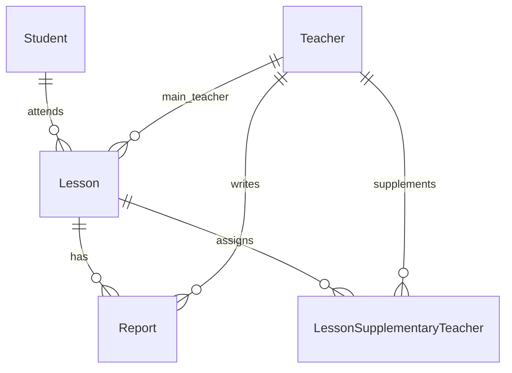

# kang-tutoring-reports

선생님의 수업 보고서 작성과 학생별 보고서 조회·누적 수업 완료 횟수를 구현한 강쌤과외 과제 MVP입니다.

## 실행

Python 3.11 이상. 아래 명령은 이 README가 있는 프로젝트 루트에서 실행합니다.

```powershell
python -m venv .venv
.venv\Scripts\python -m pip install -r requirements.txt
.venv\Scripts\python -m uvicorn app.main:app --reload --host 127.0.0.1 --port 8000
```

macOS/Linux:

```bash
python3 -m venv .venv
.venv/bin/python -m pip install -r requirements.txt
.venv/bin/python -m uvicorn app.main:app --reload --host 127.0.0.1 --port 8000
```

[학생 수업 기록](http://127.0.0.1:8000/students), [보고서 작성](http://127.0.0.1:8000/reports/new), [API 문서](http://127.0.0.1:8000/docs).

첫 실행 때 `data/tutoring.db`와 가상의 예시 인물이 자동 생성됩니다. 보고서는 처음에는 비어 있습니다. 재시작해도 기존 보고서는 유지됩니다. 선택적으로 환경변수 `DATABASE_PATH`에 다른 SQLite 파일 경로를 지정할 수 있습니다. 실행 중인 서버를 종료하려면 Ctrl+C를 누르세요.

## 사용 순서

1. 보고서 작성에서 `김하늘 · 주 선생님 김선생` 수업을 고릅니다.
2. 작성 선생님 `김선생`, 종류 `정규 수업`, 시작·종료 시간과 본문을 입력하고 저장합니다.
3. 학생 화면에서 보고서 1개, 누적 완료 1회를 확인합니다.
4. 같은 수업에 `이선생 / 보충 수업` 또는 `박선생 / 온택트 수업` 보고서를 추가합니다. 전체 보고서는 늘지만 완료 횟수는 그대로입니다.
5. 학생 선택에서 `이서준`을 조회하면 김하늘의 보고서는 표시되지 않습니다. `정다은`은 수업 배정이 없는 빈 상태 확인용입니다.

| 선생님 | 배정/역할 |
|---|---|
| 김선생 | 김하늘 수업의 주 선생님 |
| 이선생 | 김하늘 수업의 보충 선생님 |
| 박선생 | 온택트, 모든 수업에 작성 가능 |
| 최선생 | 이서준 수업의 주 선생님 |

## 기술 선택과 우선순위

- **FastAPI:** Python으로 HTTP 입력 검증, 저장, 조회를 한 애플리케이션에서 구현합니다.
- **SQLite:** 외부 DB 계정·서버 준비 없이 실행 가능하며 외래키·고유 제약·트랜잭션을 사용할 수 있습니다. 다중 서버 운영용 선택은 아닙니다.
- **Jinja + HTML/CSS:** 서버가 완성된 화면을 반환합니다. 별도 프런트엔드 빌드와 API 상태 동기화가 없어 필수 기능에 집중할 수 있습니다.
- Next.js와 Supabase는 과제의 권장 사항으로 해석했습니다. 필수 기능과 계산 검증을 먼저 구현하고 로그인·LLM 보정·보고서 편집은 제외했습니다.

## 파일 구조

```text
app/
  main.py         HTTP 요청, 폼 오류, 화면 응답
  domain.py       입력 검증, 완료 횟수 조건
  database.py     SQLite 연결, 저장, 권한 관계 확인, 조회
db/
  schema.sql      DDL
  seed.sql        가상 예시 데이터
frontend/
  templates/      작성·조회·오류 화면
  static/         CSS, report-form.js (저장 중 재클릭 방지)
tests/
  test_app.py     단위 및 실제 SQLite/HTTP 통합 테스트
  test_completion_display.py  완료 반영 사유 및 DB 제약 검증
README.md
LEARNING_GUIDE.md
requirements.txt
```

## 테이블 구조

| 테이블 | 필드와 역할 |
|---|---|
| Teacher | `id`, `name`, `phone`, `is_ontact`: 선생님 정보와 전역 온택트 자격 |
| Student | `id`, `name`, `phone`: 학생 정보 |
| Lesson | `id`, `student_id`, `main_teacher_id`: 학생과 주 선생님의 지속적인 수업 관계 |
| Report | `id`, `lesson_id`, `teacher_id`, `lesson_type`, `started_at`, `ended_at`, `report_content`, `homework_content`: 회차별 보고서 |
| LessonSupplementaryTeacher | `(lesson_id, teacher_id)` 복합 기본키: 수업별 여러 보충 선생님 연결 |



SQLite 연결마다 외래키를 활성화합니다. 주 선생님은 `main_teacher_id NOT NULL` 하나로 표현합니다. 보충은 연결 테이블로 여러 명을 표현하며 중복 배정을 막습니다. 이름/전화번호를 Report에 반복 저장하지 않고 ID로 연결합니다.

## 완료 횟수 계산과 요구사항 해석

`app/domain.py`의 `completion_credit`이 유일한 계산 규칙입니다.

```python
int(
    main_teacher_id == teacher_id
    and not is_ontact
    and lesson_type == 'regular'
)
```

학생 → Lesson → Report를 조회하고 각 보고서의 0/1 값을 합산합니다. Teacher ID가 같다는 사실만으로 세지 않고 **해당 Lesson의 주 선생님인지** 비교합니다. 별도의 완료 횟수 컬럼은 저장하지 않습니다.

| 작성자/종류 | 완료 증가 |
|---|---:|
| 해당 수업 주 선생님 + 정규 + 비온택트 | 1 |
| 주 선생님 + 보충 또는 온택트 종류 | 0 |
| 보충 선생님, 종류 무관 | 0 |
| 온택트 선생님, 종류 무관 | 0 |
| 주 선생님이면서 온택트인 경우 | 0 |

**명시적으로 채택한 가정:**

1. Lesson은 단일 회차가 아닌 지속적인 수업 관계입니다. 날짜가 Report에 있으므로 회차별 보고서를 여러 개 연결합니다.
2. 과제 앞부분의 “정규 수업 보고서” 조건을 적용합니다. 뒤의 “주 선생님 보고서만 +1”은 필요조건으로 해석합니다.
3. 주/온택트가 겹치면 온택트 +0이 우선합니다.
4. 작성자 자격과 수업 종류는 독립입니다. 배정된 보충 선생님이 정규 종류를 선택해도 저장은 가능하지만 +0입니다. 선택 종류로 작성자 자격을 바꾸거나 횟수를 올릴 수 없습니다.
5. 모든 시간은 한국 현지 시간으로 입력하며 시간대가 붙은 입력은 거부합니다. 본문은 필수, 숙제는 없을 수 있습니다.

### 설계 판단: 작성자 역할과 수업 종류를 분리

저는 배정된 보충 선생님이 수업 종류를 ‘정규’로 선택하는 것은 허용하되, 완료 횟수에는 반영하지 않는 방식을 채택했습니다.

과제는 보충 선생님의 보고서를 완료 0회로 처리하도록 명시하지만, 보충 선생님의 정규 종류 선택을 금지하지는 않습니다. 따라서 이 MVP에서는 명시되지 않은 입력 제한을 추가하기보다, 작성 가능 여부와 완료 횟수 계산을 각각 판단하도록 했습니다. 이는 과제에 명시된 유일한 정답이 아니라 제가 채택한 해석입니다.

- **작성 가능 여부:** 해당 수업에 주·보충 선생님으로 배정되어 있거나 온택트 자격이 있는지 서버에서 확인합니다.
- **완료 횟수:** 해당 수업의 주 선생님이면서 비온택트이고 정규 보고서인 경우에만 1회를 반영합니다. 화면의 종류 선택은 선생님의 배정 역할을 바꾸지 않습니다.
- **고려한 대안:** 보충 선생님의 정규 선택을 제한하면 입력 혼동은 줄어들지만, 역할과 수업 종류의 조합을 제한하는 추가 운영 규칙이 필요합니다. 이번 과제에서는 그 규칙을 임의로 도입하지 않기로 했습니다.
- **선택에 따른 보완:** ‘정규인데 왜 0회인가’라는 혼동을 줄이기 위해 학생 화면에 완료 반영 여부와 이유를 표시합니다.

예를 들어 김하늘 수업의 보충 선생님인 이선생이 정규 보고서를 작성하면 보고서 수는 1개 늘지만 완료 횟수는 늘지 않습니다. 이 동작은 `tests/test_app.py`의 `test_nonmain_authors_cannot_get_credit_by_selecting_regular`과 `tests/test_completion_display.py`의 사유 표시 테스트로 확인할 수 있습니다.

운영 정책이 ‘보충 선생님은 보충 종류만 작성 가능’으로 확정된다면 화면의 선택지와 서버 입력 검증을 함께 제한하겠습니다. 이 경우에도 완료 횟수는 서버의 배정 관계를 기준으로 계산합니다.

## 저장 검증과 오류 처리

- 실제 존재하는 수업과 선생님인지 확인합니다.
- 해당 수업의 주·배정된 보충·온택트 선생님만 저장할 수 있습니다.
- 종료 > 시작, 유효한 수업 종류, 공백이 아닌 본문, 본문·숙제 각각 최대 10,000자를 검사합니다.
- SQL 바인딩으로 입력을 전달하고 Jinja 자동 이스케이프로 본문을 표시합니다.
- 저장은 트랜잭션으로 처리합니다. 성공 후 303 redirect로 학생 화면을 열어 새로고침에 따른 재전송을 줄입니다.
- `(lesson_id, teacher_id, lesson_type, started_at)` 고유 제약으로 동일 보고서의 중복 저장을 거부합니다. 같은 날 다른 시작 시간의 수업은 허용합니다.
- 입력 오류 422, 배정되지 않은 작성자 403, 없는 데이터 404, 중복 보고서 409. 입력/업무 오류 시 폼의 값을 유지합니다. DB 장애는 내부 내용을 노출하지 않고 503으로 안내합니다.

## 테스트

```powershell
.venv\Scripts\python -m unittest discover -s tests -v
```

테스트마다 임시 SQLite를 생성하므로 실제 저장 데이터에 영향을 주지 않습니다. 완료 조건, 온택트 우선, 보고서 저장·조회, 학생별 분리, 입력 오류, 작성자 자격, 중복 제출, HTML 이스케이프를 확인합니다.

학생 화면에는 각 보고서의 +1/+0 반영 이유도 표시합니다. 저장 중 버튼을 비활성화하고, 오류 응답 또는 브라우저 뒤로 가기 후 다시 입력할 수 있습니다. JavaScript가 없어도 서버 검증과 DB 고유 제약은 적용됩니다. 최종 검증 결과는 [VERIFICATION.md](VERIFICATION.md)를 참고하세요.

## 제한과 개선 방향

- **로그인은 mock입니다.** 학생/선생님 선택은 인증이 아니며 임의 인물로 전환 가능합니다. 학생 기준 필터링은 구현했지만 실제 학생 본인만 열람하도록 보호하지 않습니다. 로컬 과제 시연용입니다.
- 실서비스에는 로그인, 서버 세션의 사용자 ID, 조회/쓰기 권한, CSRF 방어와 요청 제한을 추가해야 합니다.
- 선생님 배정과 온택트 자격을 변경하는 UI는 없습니다. DB를 직접 바꾸면 과거 완료 횟수도 현재 관계 기준으로 다시 계산됩니다. 변경 기능을 넣을 때는 작성 시점 역할 스냅샷 또는 배정 이력이 필요합니다.
- 중복 제약은 동일 입력 재전송을 막는 범위입니다. 시작 시간이나 종류를 바꾸어 같은 실제 회차를 다시 등록하는 경우까지 판별하지 않습니다. 실제 회차 관리가 필요해지면 LessonSession 엔티티와 회차별 보고서 정책을 추가합니다.
- 현재는 전체 목록을 조회합니다. 데이터가 커지면 페이지네이션과 DB 집계를 도입하고 다중 서버 배포 시 PostgreSQL로 전환합니다.
- DB DDL은 초기 생성용이며 자동 마이그레이션 도구는 포함하지 않습니다. 테스트 데이터 초기화가 필요하면 새 `DATABASE_PATH`를 사용하세요.

코드를 이해하며 설명하는 순서는 [LEARNING_GUIDE.md](LEARNING_GUIDE.md)에 정리했습니다.
